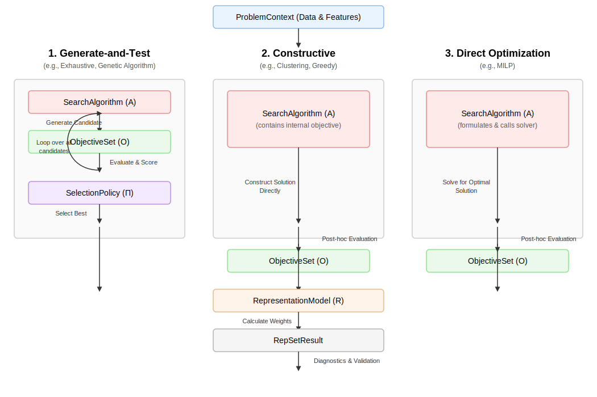

### **The Three Generalized Workflows**



Here are the three primary types of workflows that energy-repset supports. Each uses the five core modules in a slightly different sequence and with different emphasis.

#### **Workflow 1: Generate-and-Test**

This is the classic combinatorial search approach. Its philosophy is to create many candidate solutions, evaluate each one thoroughly, and then use a clear policy to select the best.

* **Status:** Fully implemented in the current software.
* **Examples:** Exhaustive (brute-force) search, Genetic Algorithms.
* **How the Modules are Used:**
  * **SearchAlgorithm (A):** Its main role is to generate candidate subsets. This is often delegated to a CombinationGenerator (which can handle constraints like "one per season").
  * **ObjectiveSet (O):** Used intensively. It is called to evaluate *every single candidate subset* generated by the search algorithm.
  * **SelectionPolicy (Pi):** Used at the very end. After the search is complete, it receives a full table of all candidates and their scores, and applies its rule (e.g., WeightedSum) to pick the winner.
  * **Summary:** There is a clear, linear sequence: the SearchAlgorithm generates, the ObjectiveSet evaluates, and the Policy decides.

**Key Modules:**

| Role | Implementation | Import |
|------|---------------|--------|
| Search | `ObjectiveDrivenCombinatorialSearchAlgorithm` | `energy_repset.search_algorithms` |
| Candidates | `ExhaustiveCombiGen`, `GroupQuotaCombiGen`, hierarchical variants | `energy_repset.combi_gens` |
| Evaluation | `ObjectiveSet` with `ScoreComponent` instances | `energy_repset.objectives` |
| Decision | `WeightedSumPolicy`, `ParetoMaxMinStrategy`, `ParetoUtopiaPolicy` | `energy_repset.selection_policies` |

**Examples:** [Ex1: Getting Started](examples/ex1_getting_started.ipynb), [Ex2: Feature Space](examples/ex2_feature_space.ipynb), [Ex3: Hierarchical Selection](examples/ex3_hierarchical_selection.ipynb), [Ex4: Representation Models](examples/ex4_representation_models.ipynb), [Ex5: Multi-Objective](examples/ex5_multi_objective.ipynb)

---

#### **Workflow 2: Constructive**

This approach builds a solution directly and iteratively, rather than testing pre-made combinations. It's generally much faster than the Generate-and-Test workflow.

* **Status:** Implemented. Three constructive algorithms are available.
* **Examples:** Hull Clustering, CTPC (Chronological Time-Period Clustering), Snippet Algorithm.
* **How the Modules are Used:**
  * **SearchAlgorithm (A):** This is the star of the show. It contains the entire complex logic of the method (e.g., the k-medoids algorithm). It has its own *internal objective* (e.g., minimize intra-cluster distance) that guides its construction process.
  * **ObjectiveSet (O):** Not used *during* the search. Its role shifts to **post-hoc evaluation**. After the SearchAlgorithm has constructed a final solution, the ObjectiveSet is used to give it a standardized score. This is crucial for comparing its result against the results from other workflow types.
  * **SelectionPolicy (Pi):** **Bypassed entirely.** The constructive nature of the algorithm *is* its own policy; the final result is the direct output of the construction process, with no separate decision step needed.
  * **Summary:** The SearchAlgorithm does all the heavy lifting to directly build a solution. The ObjectiveSet is only used for final validation.

**Key Modules:**

| Role | Implementation | Import |
|------|---------------|--------|
| Search | `HullClusteringSearch` | `energy_repset.search_algorithms` |
| Search | `CTPCSearch` | `energy_repset.search_algorithms` |
| Search | `SnippetSearch` | `energy_repset.search_algorithms` |
| Protocol | `SearchAlgorithm` (structural typing) | `energy_repset.search_algorithms` |
| Evaluation | `ObjectiveSet` (post-hoc only) | `energy_repset.objectives` |

**Examples:** [Ex6: Constructive Algorithms](examples/ex6_constructive_algorithms.ipynb)

For algorithm details, see [Constructive Algorithms](constructive_algorithms.md).

---

#### **Workflow 3: Direct Optimization**

This is the most sophisticated workflow. It formulates the entire selection problem as a single, large-scale mathematical optimization problem and uses a dedicated solver to find the globally optimal solution.

* **Status:** Not yet implemented in the current software.
* **Examples:** Mixed-Integer Linear Programming (MILP) to select periods that best reconstruct an annual duration curve.
* **How the Modules are Used:**
  * **SearchAlgorithm (A):** Its main job is to act as a bridge to a mathematical programming solver (e.g., Gurobi, HiGHS). It translates the user's problem into the strict mathematical language of the solver.
  * **ObjectiveSet (O):** Its concepts (e.g., "minimize NRMSE") are translated into the formal *mathematical objective function* of the optimization model. It is deeply embedded within the SearchAlgorithm's formulation.
  * **SelectionPolicy (Pi):** **Bypassed entirely.** The solver's goal is to find the single optimal solution that minimizes the mathematical objective. The decision is inherent in the optimization process.
  * **Summary:** The problem is handed off to a powerful external solver. The main work is in the *formulation* of the problem within the SearchAlgorithm module.

**Key Modules:**

| Role | Implementation | Status |
|------|---------------|--------|
| Search | MILP-based `SearchAlgorithm` | Planned |
| Protocol | `SearchAlgorithm` (structural typing) | `energy_repset.search_algorithms` |
| Solver | External (Gurobi, HiGHS, etc.) | N/A |

**Planned algorithms:** MILP-based duration curve reconstruction, MILP with temporal coupling constraints.

---

### **The Workflow Dataclass**

All three workflow types share the same assembly pattern. The `Workflow` dataclass bundles the three runtime components -- a `FeatureEngineer`, a `SearchAlgorithm`, and a `RepresentationModel` -- into a single object that `RepSetExperiment` can execute:

```python
import energy_repset as rep

workflow = rep.Workflow(
    feature_engineer=feature_engineer,   # F: transforms raw data into features
    search_algorithm=search_algorithm,   # A: finds optimal selection (uses O internally)
    representation_model=representation_model,  # R: calculates weights
)

experiment = rep.RepSetExperiment(context, workflow)
result = experiment.run()
```

The `Workflow` is intentionally thin: it holds references to components, not logic. The orchestration logic lives in `RepSetExperiment.run()`, which calls the components in sequence. This keeps each component independently testable and swappable.

For the full component catalog, see [Modules & Components](modules.md).
